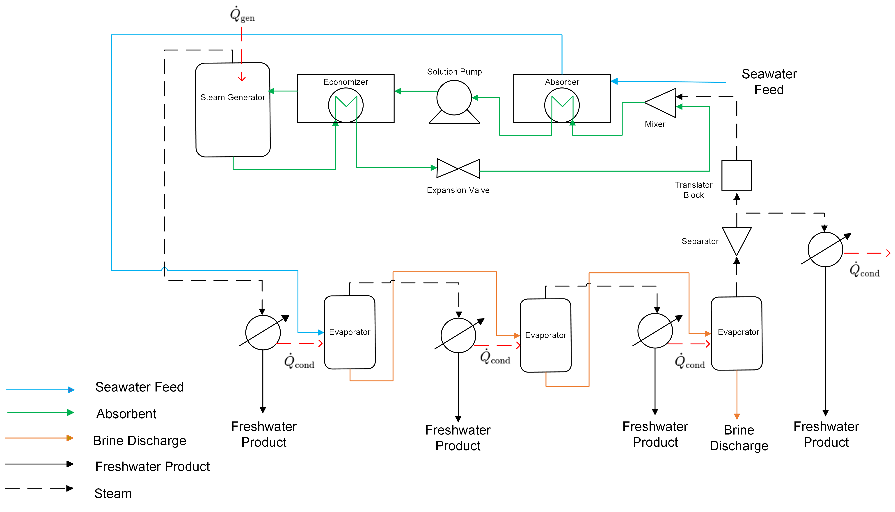

Multi-effect Distillation (MED) with Absorption Heat Pump (AHP)
====================================================================

Multi-Effect Distillation (MED) integrated with an Absorption Heat Pump (AHP) is an improved thermal desalination process that enhances the energy efficiency of the system by utilizing waste heat to preheat seawater or brackish water, 
and produces steam to drive the MED process. The superheated steam from the generator is used to run the MED loop in the same manner that is found in the 3MED documentation, but now with regenerated steam from the AHP loop, which includes a pump, expansion valve, evaporator, mixer, and heat exchangers. 
The MED and the AHP loop is connected through the translator block and the generator unit models.
The modeling of the Multi-Effect Distillation (MED) system with an Absorption Heat Pump (AHP) system is achieved through the connection of the individual unit models to create a flowsheet of the system and the inclusion of ideal and non-ideal thermodynamic models.

   **Figure 1:** Process Flow Diagram of 3MED-AHP System

Process Flowsheet
-----------------

The system starts with the preheat of the feed stream in the absorber (heat exchanger) from the circulated LiBr absorbent. 
As the absorber is modeled as a heat exchanger, there is a breakpoint between the absorber tube outlet and the pump inlet in the AHP loop. After the pump, the subcooled weak LiBr solution enters the economizer (heat exchanger)
and then enters the solar-powered generator (evaporator). Here, the subcooled weak LiBr solution is heated and separates into superheated steam and concentrated LiBr solution. The strong LiBr solution, which now has a higher concentration of LiBr, 
is then sent to the absorber, where it can absorb more water vapor, continuing its cycle. The superheated steam from the generator is used to run the MED loop in the same manner that is found in the 3MED documentation.

The flowsheet relies on the following key assumptions:

   * supports steady-state only
   * property package(s) supporting liquid and vapor is provided
   * inlet seawater feed conditions are fixed
   * complete condensation in each condenser
   * product water density is constant at 1000 kg/m3

.. image::https://github.com/PSORLab/NAWIConcentratedElectrolytes/blob/Nazia-UConn/flowsheets/benchmark_system/Desalination_Models/Working%20Models/3MED-AHP/3MED_AHP.png
   :alt: An online image
   :align: center

   Figure 1. 3MED-AHP flowsheet (to update)

Documentation for each of the WaterTAP unit models can be found below:
    * `Evaporator <https://watertap.readthedocs.io/en/latest/technical_reference/unit_models/mvc.html>`_
    * `Condenser <https://watertap.readthedocs.io/en/latest/technical_reference/unit_models/mvc.html>`_

Documentation for each of the IDAES unit models can be found below:
    * `Feed <https://idaes-pse.readthedocs.io/en/latest/reference_guides/model_libraries/generic/unit_models/feed.html>`_
    * `Heat Exchanger <https://idaes-pse.readthedocs.io/en/latest/reference_guides/model_libraries/generic/unit_models/heat_exchanger.html>`_
    * `Pressure Changer <https://idaes-pse.readthedocs.io/en/latest/reference_guides/model_libraries/generic/unit_models/pressure_changer.html>`_
    * `Mixer <https://idaes-pse.readthedocs.io/en/latest/reference_guides/model_libraries/generic/unit_models/mixer.html>`_
    * `Separator <https://idaes-pse.readthedocs.io/en/latest/reference_guides/model_libraries/generic/unit_models/separator.html>`_
    * `Translator Block <https://idaes-pse.readthedocs.io/en/latest/reference_guides/model_libraries/generic/unit_models/separator.html>`_

Documentation for each of the property models can be found below:
    * `Water <https://watertap.readthedocs.io/en/latest/technical_reference/property_models/water.html>`_
    * `Seawater <https://watertap.readthedocs.io/en/latest/technical_reference/property_models/seawater.html>`_
    * `LiBr` #(to add link here)

Documentation of the thermodynamic models used can be found below:
   * `r-ENRTL <https://github.com/watertap-org/watertap-renrtl/blob/main/src/watertap_contrib/rENRTL/examples/flowsheets/evaporator_with_enrtl/how_to_setup_evaporator_with_enrtl.rst>`_
   # * (multi renrtl)

The objective is to perform simulations with degrees of freedom in the design of specific unit models to meet the specified water recovery target for the system. The variables that are not fixed are those that are simulated.

Degrees of Freedom
------------------
The following variables are specified for the flowsheet:

.. csv-table::
   :header: "Variable", "Details"

   "Feed water conditions", "H2O mass flow rate, TDS mass flow rate, temperature, and pressure"
   "Pump", "H2O mass flow rate, TDS mass flow rate, temperature, pressure, ΔP, efficiency"
   "Economizer", "H2O mass flow rate, TDS mass flow rate, temperature, and pressure, area, heat transfer coefficient (U), crossflow factor"
   "Generator", "Outlet vapor pressure, heat transfer coefficient (U), area, heat transfer value, ΔT in"
   "Expansion valve", "ΔP, efficiency"
   "Mixer", "Inlet H2O mass flow rate, TDS mass flow rate, temperature, and pressure"
   "Condenser", "Outlet temperature"
   "Evaporator", "Outlet brine temperature, area, heat transfer coefficient (U), ΔT in, ΔT out"
   "Separator", "Split fraction, outlet H2O mass flow rates"
   "Translator block", "Outlet TDS mass flow rates"

Flowsheet Specifications
------------------------
The following values were fixed for specific variables during the initialization of the model flowsheet at 80% water recovery. 

.. csv-table::
   :header: "Description", "Value", "Units"

   "**Feed Water**"
   "Water mass flow rate [1]","0.24", ":math:`\text{kg/s}`"
   "TDS mass flow rate [1]", "0.0058", ":math:`\text{kg/s}`"
   "Temperature [1]", "300.15", ":math:`\text{K}`"
   "Pressure", "101325", ":math:`\text{Pa}`"
   "**Absorber (Heat exchanger)**"
   "Heat transfer coefficient (U) [1]","500", ":math:`\text{W/K-m^2}`"
   "Shell outlet temperature [1]", "348.15", ":math:`\text{K}`"
   "Crossflow factor", "0.5", ":math:`\text{dimensionless}`"
   "**Pump (Pressure changer)**"
   "Inlet Water mass flow rate","0.45", ":math:`\text{kg/s}`"
   "Inlet TDS mass flow rate", "0.55", ":math:`\text{kg/s}`"
   "Inlet Temperature", "423.15", ":math:`\text{K}`"
   "Inlet Pressure", "10000", ":math:`\text{Pa}`"
   "ΔP", "2000", ":math:`\text{Pa}`"
   "Efficiency", "0.7", ":math:`\text{dimensionless}`"
   "**Economizer (Heat exchanger)**"
   "Inlet Tube Water mass flow rate","0.35", ":math:`\text{kg/s}`"
   "Inlet Tube TDS mass flow rate", "0.65", ":math:`\text{kg/s}`"
   "Inlet Tube Temperature", "473.15", ":math:`\text{K}`"
   "Inlet Tube Pressure", "30000", ":math:`\text{Pa}`"
   "Heat transfer coefficient (U) [1]","600", ":math:`\text{W/K-m^2}`"
   "Area", "40", ":math:`\text{m^2}`"
   "Crossflow factor", "0.5", ":math:`\text{dimensionless}`"
   "**Generator (Evaporator)**"
   "Outlet vapor pressure [1]","30000", ":math:`\text{Pa}`"
   "Heat transfer coefficient (U) [1]","500", ":math:`\text{W/K-m^2}`"
   "Area", "10", ":math:`\text{m^2}`"
   "Heat transfer [1]", "111000", ":math:`\text{W}`"
   "ΔT in", "10", ":math:`\text{K}`"
   "**Expansion Valve (Pressure changer)**"
   "ΔP", "-20000", ":math:`\text{Pa}`"
   "Efficiency", "0.7", ":math:`\text{dimensionless}`"
   "**Condenser 1**"
   "Outlet temperature", "324.15", ":math:`\text{K}`"
   "**Condenser 2**"
   "Outlet temperature", "326.15", ":math:`\text{K}`"
   "**Condenser 3**"
   "Outlet temperature", "331.15", ":math:`\text{K}`"
   "**Condenser 4**"
   "Outlet temperature", "339.15", ":math:`\text{K}`"
   "**Evaporator 1**"
   "Outlet brine temperature", "325.15", ":math:`\text{K}`"
   "Heat transfer coefficient (U) [1]", "1200", ":math:`\text{W/K-m^2}`"
   "Area", "10", ":math:`\text{m^2}`"
   "ΔT in", "2", ":math:`\text{K}`"
   "ΔT out [1]", "2.5", ":math:`\text{K}`"
   "**Evaporator 2**"
   "Outlet brine temperature", "328.15", ":math:`\text{K}`"
   "Heat transfer coefficient (U) [1]", "1000", ":math:`\text{W/K-m^2}`"
   "Area", "30", ":math:`\text{m^2}`"
   "ΔT in", "8", ":math:`\text{K}`"
   "ΔT out [1]", "2.5", ":math:`\text{K}`"
   "**Evaporator 3**"
   "Outlet brine temperature", "338.15", ":math:`\text{K}`"
   "Heat transfer coefficient (U) [1]", "1000", ":math:`\text{W/K-m^2}`"
   "Area", "20", ":math:`\text{m^2}`"
   "ΔT in", "10", ":math:`\text{K}`"
   "ΔT out [1]", "2.5", ":math:`\text{K}`"
   "**Mixer**"
   "Inlet 1 Water mass flow rate ", "0.15", ":math:`\text{kg/s}`"
   "Inlet 1 TDS mass flow rate", "0", ":math:`\text{kg/s}`"
   "Inlet 1 Temperature", "338.15", ":math:`\text{K}`"
   "Pressure", "31000", ":math:`\text{Pa}`"
   "**Separator**"
   "Split fraction", "0.5", ":math:`\text{dimensionless}`"
   "**Translator block**"
   "Outlet TDS mass flow rate", "0", ":math:`\text{kg/s}`"

References
-----------
[1] Stuber, M. D., Sullivan, C., Kirk, S. A., Farrand, J. A., Schillaci, P. V., Fojtasek, B. D., & Mandell, A. H. (2015). 
Pilot demonstration of concentrated solar-powered desalination of subsurface agricultural drainage water and 
other brackish groundwater sources. Desalination, 355, 186-196. 
https://doi.org/10.1016/j.desal.2014.10.037.

