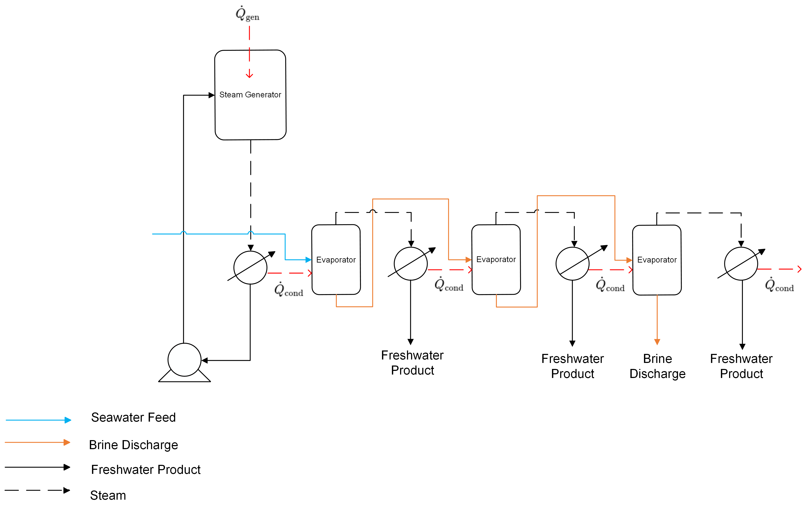

Multi-effect Distillation (MED)
==================================

Multi-Effect Distillation (MED) is a widely used thermal desalination process that involves multiple stages or "effects" to produce freshwater from seawater or brackish water.
The flowsheet consists primarily of evaporators, condensers, a pump, and a heater unit that represents a steam generator.
In this flowsheet, there is a loop between the steam generator and the condenser of the first effect in which the raising steam is used to power the MED system [1]. 
Modeling the Multi-Effect Distillation (MED) system is performed through the connection of individual unit models in the flowsheet and the inclusion of choice of ideal or different non-ideal thermodynamic models. 

   **Figure 1:** Process Flow Diagram of 3MED System

Process Flowsheet
-----------------

The system starts with a steam generator, which receives heat input from a solar array. The steam generated here serves as the primary heat source for the MED process.
Seawater is fed into the first evaporator, where it receives the latent heat from the condensed steam in the first condenser. This heat causes a portion of the feed to evaporate, producing steam and brine. 
The steam produced in the first effect moves on to the next condenser and this sequence of heat transfer and freshwater extraction continues through subsequent effects in the system. 
At each evaporator, the remaining concentrated brine is discharged and the freshwater is collected which represents the total product flow.
The flowsheet relies on the following key assumptions:

   * supports steady-state only
   * property package(s) supporting liquid and vapor is provided
   * inlet seawater feed conditions are fixed
   * complete condensation in each condenser
   * product water density is constant at 1000 kg/m3

.. image::https://github.com/PSORLab/NAWIConcentratedElectrolytes/blob/Nazia-UConn/flowsheets/benchmark_system/Desalination_Models/Working%20Models/3MED%20Only/3MED.png
   :alt: An online image
   :align: center

   Figure 1. 3MED flowsheet

Documentation for each of the WaterTAP unit models can be found below:
    * `Evaporator <https://watertap.readthedocs.io/en/latest/technical_reference/unit_models/mvc.html>`_
    * `Condenser <https://watertap.readthedocs.io/en/latest/technical_reference/unit_models/mvc.html>`_

Documentation for each of the IDAES unit models can be found below:
    * `Feed <https://idaes-pse.readthedocs.io/en/latest/reference_guides/model_libraries/generic/unit_models/feed.html>`_
    * `Pump <https://idaes-pse.readthedocs.io/en/latest/reference_guides/model_libraries/generic/unit_models/pump.html>`_ 
    * `Heater <https://idaes-pse.readthedocs.io/en/latest/reference_guides/model_libraries/generic/unit_models/heater.html>`_

Documentation for each of the property models can be found below:
    * `Water <https://watertap.readthedocs.io/en/latest/technical_reference/property_models/water.html>`_
    * `Seawater <https://watertap.readthedocs.io/en/latest/technical_reference/property_models/seawater.html>`_

Documentation of the thermodynamic models used can be found below:
   * `r-ENRTL <https://github.com/watertap-org/watertap-renrtl/blob/main/src/watertap_contrib/rENRTL/examples/flowsheets/evaporator_with_enrtl/how_to_setup_evaporator_with_enrtl.rst>`_
   # * (multi renrtl)

The objective is to perform simulation with degrees of freedom in the design of specific unit models, such as the evaporator areas and the heat transfer requirements of the various unit models, to meet the specified amount of water recovery target of the system. The variables that are not fixed are those that are simulated.

Degrees of Freedom
------------------
The following variables are specified for the flowsheet:

.. csv-table::
   :header: "Variable", "Details"

   "Feed water conditions", "H2O mass flow rate, TDS mass flow rate, temperature, and pressure"
   "Condenser", "Outlet temperature"
   "Evaporator", "Outlet brine temperature, area, heat transfer coefficient (U), ΔT in, ΔT out"
   "Pump", "Outlet pressure, efficiency"
   "Steam generator", "Outlet temperature, heat transfer value"

Flowsheet Specifications
------------------------
The following values were fixed for specific variables during the initialization of the model flowsheet.

.. csv-table::
   :header: "Description", "Value", "Units"

   "**Feed Water**"
   "Water mass flow rate [1]","0.15", ":math:`\text{kg/s}`"
   "TDS mass flow rate [1]", "0.0035", ":math:`\text{kg/s}`"
   "Temperature [1]", "300.15", ":math:`\text{K}`"
   "Pressure", "101325", ":math:`\text{Pa}`"
   "**Condenser 1**"
   "Outlet temperature", "332.15", ":math:`\text{K}`"
   "Inlet Water mass flow rate", "0", ":math:`\text{kg/s}`"
   "**Condenser 2**"
   "Outlet temperature", "330.15", ":math:`\text{K}`"
   "**Condenser 3**"
   "Outlet temperature", "333.15", ":math:`\text{K}`"
   "**Condenser 4**"
   "Outlet temperature", "338.15", ":math:`\text{K}`"
   "**Evaporator 1**"
   "Outlet brine temperature", "338.15", ":math:`\text{K}`"
   "Heat transfer coefficient (U) [1]", "500", ":math:`\text{W/K-m^2}`"
   "Area", "10", ":math:`\text{m^2}`"
   "ΔT in", "10", ":math:`\text{K}`"
   "ΔT out [1]", "8", ":math:`\text{K}`"
   "**Evaporator 2**"
   "Outlet brine temperature", "339.15", ":math:`\text{K}`"
   "Heat transfer coefficient (U) [1]", "500", ":math:`\text{W/K-m^2}`"
   "Area", "10", ":math:`\text{m^2}`"
   "ΔT in", "10", ":math:`\text{K}`"
   "ΔT out [1]", "8", ":math:`\text{K}`"
   "**Evaporator 3**"
   "Outlet brine temperature", "343.15", ":math:`\text{K}`"
   "Heat transfer coefficient (U) [1]", "500", ":math:`\text{W/K-m^2}`"
   "Area", "10", ":math:`\text{m^2}`"
   "ΔT in", "10", ":math:`\text{K}`"
   "ΔT out [1]", "8", ":math:`\text{K}`"
   "**Pump**"
   "Outlet pressure [1]", "30000", ":math:`\text{Pa}`"
   "Efficiency", "0.8", ":math:`\text{dimensionless}`"
   "**Steam generator (Heater)**"
   "Outlet temperature [1]", "342.25", ":math:`\text{K}`"
   "Heat transfer [1]", "96370", ":math:`\text{W}`"

References
-----------
[1] Stuber, M. D., Sullivan, C., Kirk, S. A., Farrand, J. A., Schillaci, P. V., Fojtasek, B. D., & Mandell, A. H. (2015). 
Pilot demonstration of concentrated solar-powered desalination of subsurface agricultural drainage water and 
other brackish groundwater sources. Desalination, 355, 186-196. 
https://doi.org/10.1016/j.desal.2014.10.037.

